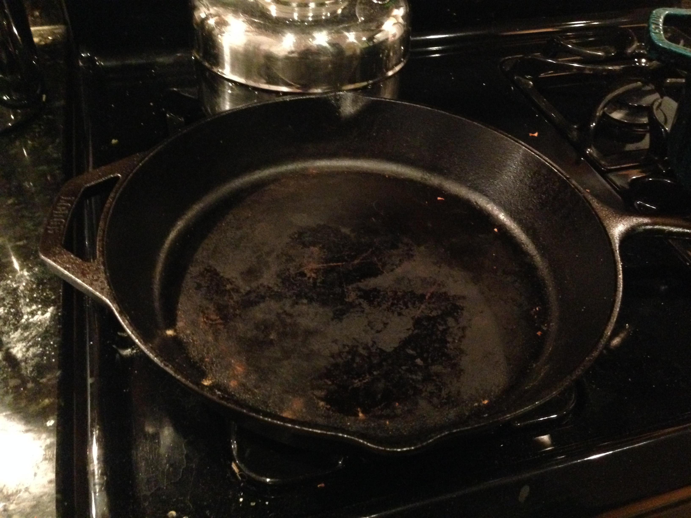
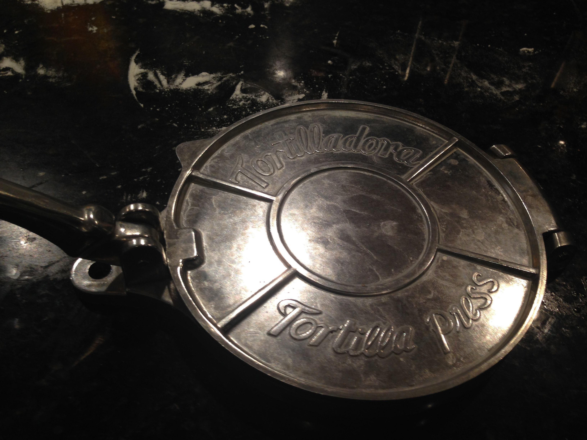

bad-ass tortillas
=====================

If you are making tacos, don't settle for corporate store bought tortillas. Make your own like a real person!

First get a cast iron pan:

and then one of these bad-ass tortilla presses:

Buy your lard from a place like this:

* 2 cups all purpose flour
* 1/4 cup lard (cut into lil' pieces)
* 1 teaspoon kosher salt
* 2/3 tablespoon oil
* 1/2 cup water (luke warm)

Mix all ingredients together except oil and water. Drizzle oil over mixture and mix with hands. Add water and mix and knead again until doughy. Let chill for about an hour in plastic wrappers.

Heat large cast iron skillet (or something more authentic if you've got it) over medium heat. Cut dough into about 12 pieces that are round. Use a proper tortilla press (or something more authentic if you've got it) to make 'em flat and then put on the skillet. Wait until the transparent parts turn opaque and flip em. Put cooked tortillas in a *dirty* cloth napkin to keep 'em warm. End recipe. Paz, amor, y dinero.
